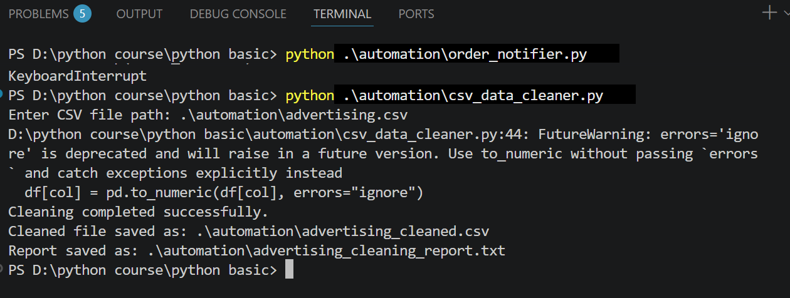
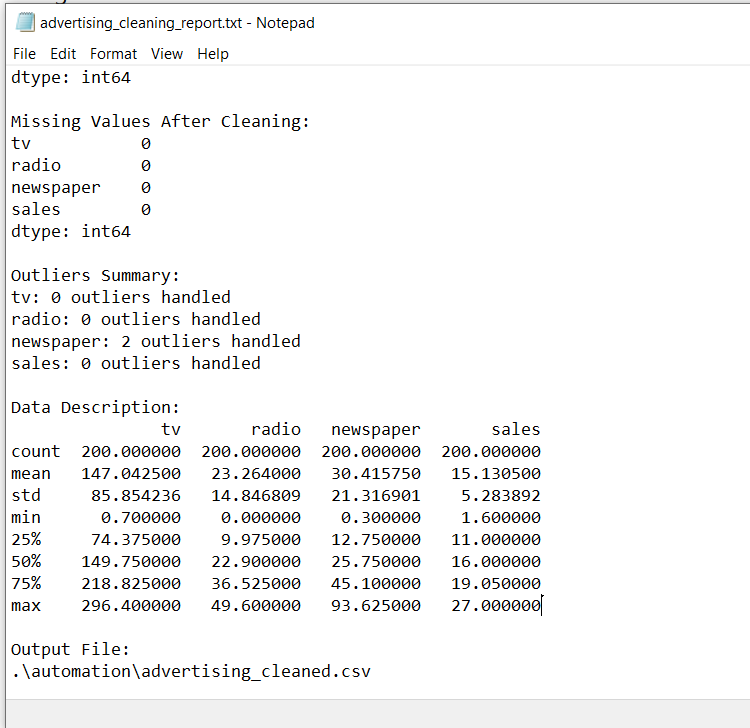

# CSV Data Cleaner Automation

A Python automation project that reads a CSV file, cleans the data automatically, saves a cleaned version, and generates a cleaning report.

This project is part of the **Code More, Watch Less** automation series.

---

## Project Goal

The goal of this project is to automate the first step of data cleaning.

Instead of manually checking missing values, duplicated rows, messy column names, and outliers, this script handles these steps automatically and creates a clear report about what happened to the data.

---

## What This Script Does

The script performs several cleaning steps:

- Reads a CSV file
- Standardizes column names
- Removes duplicated rows
- Cleans text columns and extra spaces
- Converts data types where possible
- Handles missing values
- Handles outliers using the IQR method
- Saves a cleaned CSV file
- Generates a text report

---

## How It Works

1. The user runs the Python script.
2. The script asks for the CSV file path.
3. The CSV file is loaded using pandas.
4. The data cleaning steps are applied automatically.
5. A cleaned CSV file is saved.
6. A text report is generated to summarize the cleaning process.

---

## Example Terminal Output

After running the script, the terminal shows the generated files:



---

## Cleaning Report Example

The script also generates a text report that includes:

- Original data shape
- Cleaned data shape
- Missing values before and after cleaning
- Number of duplicated rows removed
- Outliers summary
- Data description
- Output file path



---

## Output Files

After running the script, two files will be generated:

```text
advertising_cleaned.csv
advertising_cleaning_report.txt
```

- `advertising_cleaned.csv`: the cleaned version of the dataset.
- `advertising_cleaning_report.txt`: a report that summarizes the cleaning process.
